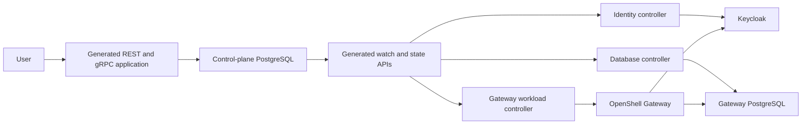

This gate runs the actual OpenShell Gateway image with the STEGO Hypershell API,
database controller, identity controller, and Gateway workload controller.
It tests provider management inside the Gateway. Sandbox execution remains open.

Run `scripts/check-gateway-workload.sh` on Linux amd64. Set
`STEGO_TEST_POSTGRES_DSN` to a PostgreSQL connection that can create test databases.
Docker is required. The script creates and removes an isolated kind cluster.
It installs pinned cert-manager and Agent Sandbox releases. It requires the real
Keycloak fixture, PostgreSQL, and Kubernetes. The test and controller processes
use the race detector. CI has a separate `gateway-workload` job for this gate.

`TestGatewayWorkloadWithDatabaseAndIdentity` performs these steps:

1. Use a real Keycloak browser login with PKCE to create a Gateway through REST.
2. Let the database controller provision its private TLS database.
3. Let the identity controller publish the Gateway audience and owner role.
4. Let the workload controller start the actual Gateway image.
5. Reject missing, forged, and wrong-audience tokens through Gateway gRPC.
6. Deny provider access to a user without a Gateway grant.
7. Create and retrieve a provider with an owner token.
8. Restart the Gateway Pod and workload controller, then retrieve the provider.
9. Restart the database and replace the Gateway namespace. Check the provider
   and require identical signing and encryption keys.
10. Change the cluster assignment and delete the Gateway while its workload
    controller is stopped. Require cleanup of owned resources in the former
    cluster. This check does not migrate data to another cluster.
11. Force the database deletion transaction to fail after Gateway removal.
    Remove the failure and require automatic database namespace cleanup.

The protocol in `contracts/gateway/` comes from OpenShell source revision
`681c9b2d8b9887f230cee4871bdbdbc9a362dfc8`. This is the source revision recorded
in the pinned Gateway image. The test compiles the original protocol descriptors
and sends real gRPC requests. The source manifest records each file hash.

STEGO supplies the application process, storage, transactions, events,
authentication, RPC transport, and Kubernetes resource client. Hypershell supplies
placement, resource definitions, identity policy, readiness, and cleanup policy.
No rh-trex-ai generator or runtime is used by this workflow.

The Gateway controller accepts one configured managed-cluster ID. It does not
provision Gateways assigned to other clusters. Deleted Gateways can still require
cleanup of resources owned in the former cluster. Its Kubernetes connection must
identify the configured cluster. Dynamic cluster connection discovery and data
migration between clusters remain open. The database controller also uses one
configured cluster.

The controller reads fresh privileged Gateway state before it acts. A missing
or denied API response cannot authorize deletion. The generated Kubernetes
client checks ownership and uses the observed UID and resource version for
updates and deletion. The controller records readiness only after Kubernetes
reports the requested Deployment generation and ready replica. A provider error
clears a stored ready status. Failed status writes are retried.

The Gateway uses the limited database application account. It receives no
PostgreSQL bootstrap credentials. Its database URI requires certificate and
hostname verification. Database credentials are supplied through a Secret and
an environment variable. They are not command arguments.

The signing key and credential encryption key are first stored in the database
namespace. The Secret is immutable. A namespace annotation records a hash of
the original key data. The Gateway namespace receives an immutable copy. Missing,
replaced, inconsistent, or foreign key material causes an error. The controller
does not silently rekey an existing database. A restore must include the original
database, key Secret, and namespace identity metadata. Backup, restore automation,
and deliberate key rotation remain open.

A Gateway link on the database namespace preserves cleanup work after the
Gateway namespace is gone. The controller requests deletion of a deployment
database only after Gateway resources are absent. The database controller then
removes the database workload. Shared CNPG database provisioning is not implemented
by this controller.

The Gateway image must match an administrator-managed release pinned by digest.
The supervisor and sandbox image references come from trusted controller settings
and must also use digests. The current controller rejects unimplemented workload
overrides before resource writes. These include alternate credential drivers,
external DNS, TLS mode, and public Service configuration.

The Gateway Pod runs as UID/GID 1000. It has a read-only root filesystem,
no added capabilities, no privilege escalation, seccomp, and CPU and memory
limits. The namespace uses the restricted Pod security policy. The Deployment
has one replica and uses `Recreate`; rolling upgrades and multiple active
Gateway replicas need separate evidence.

The controller requires these settings:

| Setting | Purpose |
| --- | --- |
| `HYPERSHELL_API_GRPC_ADDR`, `HYPERSHELL_API_CA_FILE`, `HYPERSHELL_API_TOKEN_FILE` | Verified API connection and configured control-plane identity |
| `HYPERSHELL_KUBERNETES_URL`, `HYPERSHELL_KUBERNETES_CA_FILE`, `HYPERSHELL_KUBERNETES_TOKEN_FILE` | Verified Kubernetes connection |
| `HYPERSHELL_MANAGED_CLUSTER_ID` | Managed-cluster assignment |
| `HYPERSHELL_GATEWAY_CLUSTER_ISSUER` | Configured cert-manager ClusterIssuer |
| `HYPERSHELL_GATEWAY_OIDC_ISSUER` | Exact trusted issuer URL |
| `HYPERSHELL_GATEWAY_TRUST_BUNDLE` | PEM CA bundle used by Gateway outbound TLS |
| `HYPERSHELL_GATEWAY_SANDBOX_IMAGE`, `HYPERSHELL_GATEWAY_SUPERVISOR_IMAGE` | Images pinned by digest |

Token files must have mode 0400 or 0600. Replace them before expiry; generated
clients read them for each request. Apply
`deploy/gateway-workload-controller-rbac.yaml` in the configured cluster. The
namespace and identity must exist before the controller starts.

The trust bundle must include every CA needed by the Gateway's outbound clients.
It is supplied through `SSL_CERT_FILE`, which overrides native root discovery in
the image's TLS client library. See the library's
[platform rules](https://github.com/rustls/rustls-native-certs#platform-support).
The isolated test uses a private Keycloak CA and a private Docker bridge address.
The same issuer URL is reachable from the host and Gateway Pod. No TLS verification
is disabled.

The final actual-image test passed in 163.20 seconds. Its acceptance package took
164.243 seconds with the race detector. This run included former-cluster cleanup
and a forced database deletion failure. These are workflow durations, not
production latency measurements.

The complete variant race suite passed with PostgreSQL and Keycloak required;
its acceptance package took 331.637 seconds. The database workflow and deletion
replay regression package passed in 74.076 seconds. Focused race tests and vet
passed after the final ownership and trust-file checks. The Go vulnerability
scan found no known vulnerabilities. Pinned generation completed without drift;
the committed output must also pass `scripts/generate.sh --check`.

The trust-file check exports only parsed certificates to the public ConfigMap.
It rejects private-key blocks. It does not copy unrelated file content.

Deletion before the first workload reconciliation remains an open recovery case.
If no Gateway resource or database namespace link exists, the current live watch
and resource scan cannot recover that deleted Gateway ID. A retained-ID replay
test must close this gap. Progress through large resource lists also needs a
separate test; the current scan has a time limit and starts again on reconnect.

The pinned image requires workspace membership in addition to its standard user
role. The user was asked whether a Hypershell viewer grant should also create
default-workspace membership. That decision remains open. This gate proves owner
access and ungranted-user denial; it does not claim complete viewer access.

Sandbox execution also needs separate work. The reference supervisor requests
capabilities that the current restricted namespace rejects. Do not weaken that
policy to treat this provider-management gate as complete sandbox evidence.
Sandbox isolation, network policy enforcement, public routes, OpenShift behavior,
image vulnerability scans, certificate renewal, backup, restore, capacity, and
complete CLI and console behavior remain open. The Go vulnerability scan does
not assess the external container images.
